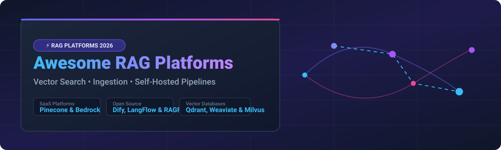

# 🚀 Awesome Retrieval-Augmented Generation (RAG) Platform Ecosystem

  
  
  
  
  

---

## 💡 Overview & Ecosystem Insights

Welcome to the **Curated Guide to Retrieval-Augmented Generation (RAG) Platforms, Managed Vector Engines, and Open-Source RAG Infrastructure**. 

This repository tracks notable **commercial RAG platforms**, **managed vector databases**, and **open-source RAG frameworks** that connect Large Language Models (LLMs) to private enterprise data, unstructured documents, and API knowledge repositories—enabling grounded, hallucination-free, cited, and accurate AI responses.

### 🌐 Market Size & Industry Structure
> 📊 **Estimated Market Size**: The global Retrieval-Augmented Generation (RAG) and Enterprise Search market is estimated at **$2.5 Billion in 2026** and is projected to reach **$11.8 Billion by 2030** (CAGR ~47%).  
> 🧩 **Market Fragmentation**: The sector is **moderately to highly fragmented**. While hyperscalers (AWS Bedrock Knowledge Bases) and specialized vector database leaders (Pinecone, Qdrant, Weaviate) capture enterprise storage workloads, open-source orchestration engines (Dify, LangChain, LlamaIndex, RAGFlow) prevent a single "winner-take-all" outcome by giving developers sovereignty over document processing, embedding, and hybrid retrieval.

---

## 📑 Table of Contents
- [🏢 SaaS & Managed RAG Platforms](#-saas--managed-rag-platforms)
- [🔓 Open-Source GitHub Projects](#-open-source-github-projects)
- [🛠️ How to Contribute](#️-how-to-contribute)
- [💖 Support](#-support)
- [⚠️ Disclaimer](#️-disclaimer)
- [⭐ Star History](#-star-history)

---

## 🏢 SaaS & Managed RAG Platforms

Below is a curated selection of commercial and fully managed RAG platforms, vector databases, and enterprise document ingestion services, **sorted by Company Scale (Valuation / Revenue in Descending Order)**:

| Platform / Service | Scale / Valuation / Revenue | Starting Paid Tier Pricing | Free Tier / Trial Limits | Key Use Case & Description |
| :--- | :--- | :--- | :--- | :--- |
| **[Amazon Bedrock Knowledge Bases](https://aws.amazon.com/bedrock/knowledge-bases/)** | **~$1.8 Trillion (AWS Parent Market Cap)** | $0.10 per GB/month storage + $0.0001 per retrieval API call | AWS Free Tier: 2,000 free retrieval queries/month for 12 months | **Best for AWS-native RAG**: Fully managed document chunking, embedding, vector storage, and foundation model generation. |
| **[Pinecone](https://www.pinecone.io/)** | **$750 Million Valuation** | $50/month (Standard plan) | Free Starter Plan: 1 project, 1 index, up to 100k vectors (2GB storage) | **Best for vector search at scale**: Leading enterprise managed vector database with serverless indexing and hybrid search. |
| **[Glean](https://www.glean.com/)** | **$4.6 Billion Valuation** | $12/user/month (Enterprise packages) | 30-day Enterprise Free Trial for up to 50 users | **Best for enterprise knowledge**: Permission-aware generative search and RAG across company SaaS suites (Slack, Jira, Google Drive). |
| **[Qdrant Cloud](https://qdrant.tech/)** | **$280 Million Valuation** | $25/month (Cluster tier) | Free Forever Cluster: 1GB cluster storage (~100k vectors) | **Best for high-performance vector search**: Managed Rust-based vector search engine with payload filtering. |
| **[Weaviate Cloud](https://weaviate.io/)** | **$200 Million Valuation** | $25/month (Serverless tier) | $100 Free Credit for 14-day Sandbox Cluster | **Best for AI-native applications**: Vector database with GraphQL API, hybrid BM25 search, and multi-modal embeddings. |
| **[Unstructured](https://unstructured.io/)** | **$200 Million Valuation** | $10/1,000 pages processed | 14-day Free Trial with 1,000 free document pages | **Best for document processing**: Ingests, cleans, and partitions complex PDFs, slides, tables, and scanned docs into RAG-ready JSON. |
| **[LlamaIndex Cloud](https://www.llamaindex.ai/)** | **$80 Million Valuation** | $50/month (Developer plan) | Free Tier: 1,000 document parses/month + 10k retrieval queries/month | **Best for developer-friendly RAG**: Managed document parsing (LlamaParse), indexing workflows, and advanced retrieval APIs. |
| **[Chroma Cloud](https://www.trychroma.com/)** | **$75 Million Valuation** | $20/month (Managed Hosted) | Free Tier: 50,000 vectors & 1GB hosted index storage | **Best for rapid RAG prototypes**: AI-native embedding database for fast Python/JS application integration. |
| **[Dify Knowledge](https://dify.ai/)** | **$50 Million Valuation** | $59/month (Professional plan) | Free Sandbox: 200 GPT/LLM call credits & 5MB document upload limit | **Best for visual RAG development**: Cloud-hosted visual orchestration platform with built-in document management. |
| **[Ragie](https://www.ragie.ai/)** | **$15 Million Valuation** | $29/month (Starter tier) | Free Tier: 100 document uploads & 1,000 search queries/month | **Best for rapid RAG development**: Fully managed RAG-as-a-service providing instant chunking, embedding, and retrieval APIs. |

---

## 🔓 Open-Source GitHub Projects

The open-source RAG ecosystem offers complete self-hosted platforms, modular frameworks, vector search engines, and document parsers. Below is a comprehensive list **sorted by GitHub Stars_Count (Descending)**, with social badges linking directly to each repository's stargazers page:

### 🌟 Top Open-Source RAG Ecosystem (Sorted by Stars)

- **[Dify](https://github.com/langgenius/dify)**   
  **The leading open-source LLM app development platform** (Apache-2.0). Features a visual workflow builder for RAG pipelines, AI agents, and prompt orchestration with built-in document ingestion and hybrid retrieval.

- **[LangFlow](https://github.com/langflow-ai/langflow)**   
  **Visual framework for building multi-agent RAG applications** (MIT). Drag-and-drop canvas for composing vector search, document chunking, and custom retriever components.

- **[Open WebUI](https://github.com/open-webui/open-webui)**   
  **User-friendly self-hosted Web UI for LLMs and RAG** (MIT). Integrated document upload, hybrid vector search, Ollama support, and granular multi-user permissions.

- **[LangChain](https://github.com/langchain-ai/langchain)**   
  **The standard framework for LLM application development** (MIT). Offers comprehensive RAG chains, document loaders, vector store abstractions, and agentic retrieval.

- **[RAGFlow](https://github.com/infiniflow/ragflow)**   
  **Open-source RAG engine based on deep document understanding** (Apache-2.0). Features template-based PDF parsing, visual grounding citations, and hallucination reduction.

- **[GPT4All](https://github.com/nomic-ai/gpt4all)**   
  **Privacy-aware desktop client with LocalDocs RAG capability** (MIT). Chat with local files and PDFs completely offline on consumer CPUs/GPUs.

- **[Docling](https://github.com/docling-project/docling)**   
  **IBM Research document processing framework for RAG** (MIT). Converts complex PDFs, scans, and tables into cleanly structured Markdown and JSON.

- **[AnythingLLM](https://github.com/Mintplex-Labs/anything-llm)**   
  **All-in-one desktop and enterprise RAG application** (MIT). Chat with documents, web pages, and databases with workspace isolation and zero-setup vector databases.

- **[Flowise](https://github.com/FlowiseAI/Flowise)**   
  **Open-source UI visual tool to build LangChain RAG flows** (Apache-2.0). Build custom document QA pipelines via node-based visual drag-and-drop.

- **[LlamaIndex](https://github.com/run-llama/llama_index)**   
  **Data framework for LLM & RAG applications** (MIT). The reference code-first framework for data connectors, advanced chunking, indexing, and reranking retrieval.

- **[Milvus](https://github.com/milvus-io/milvus)**   
  **Cloud-native vector database built for scale** (Apache-2.0). Handles multi-billion vector datasets with high throughput and horizontal scalability.

- **[Marker](https://github.com/VikParuchuri/marker)**   
  **Fast, accurate PDF to Markdown converter** (GPL-3.0). Extracts formulas, tables, and images for clean RAG ingestion.

- **[Quivr](https://github.com/QuivrHQ/quivr)**   
  **Open-source personal RAG second brain** (Apache-2.0). Dump files, notes, and links to query with local or cloud LLMs.

- **[Khoj](https://github.com/khoj-ai/khoj)**   
  **Open-source AI desktop search assistant** (AGPL-3.0). RAG search across personal notes, PDF documents, and web search.

- **[Microsoft GraphRAG](https://github.com/microsoft/graphrag)**   
  **Knowledge graph-driven RAG system by Microsoft** (MIT). Extracts entity-relation knowledge graphs from complex text corpora for global analytical queries.

- **[Qdrant](https://github.com/qdrant/qdrant)**   
  **High-performance Rust vector database** (Apache-2.0). Vector search engine with rich payload filtering and fast distance metrics.

- **[Onyx (formerly Danswer)](https://github.com/onyx-dot-app/onyx)**   
  **Open-source enterprise search and conversational RAG platform** (MIT). Direct connectors to Slack, Google Drive, Notion, GitHub, and Confluence.

- **[Chroma](https://github.com/chroma-core/chroma)**   
  **AI-native embedding database** (Apache-2.0). Simple developer API focused on fast prototyping and local embedding storage.

- **[Haystack](https://github.com/deepset-ai/haystack)**   
  **Production-ready Python RAG framework by deepset** (Apache-2.0). Modular pipelines for semantic search, question answering, and hybrid reranking.

- **[Pgvector](https://github.com/pgvector/pgvector)**   
  **Open-source vector similarity search extension for PostgreSQL** (PostgreSQL License). Enables vector embeddings directly inside existing Postgres tables.

- **[Weaviate](https://github.com/weaviate/weaviate)**   
  **Open-source vector database with hybrid search** (BSD-3-Clause). Built-in ML vectorizers, GraphQL interface, and inverted index BM25 integration.

- **[RAGAS](https://github.com/explodinggradients/ragas)**   
  **Evaluation framework for RAG pipelines** (Apache-2.0). Provides quantitative metrics for context relevance, faithfulness, and answer correctness.

- **[Unstructured](https://github.com/Unstructured-IO/unstructured)**   
  **Open-source document pre-processing library** (Apache-2.0). Ingests raw documents (PDF, DOCX, PPTX) into structured text elements.

- **[PyMuPDF](https://github.com/pymupdf/PyMuPDF)**   
  **High-performance C/Python library for PDF text extraction** (AGPL-3.0). Lightning-fast parsing of PDF text, images, and metadata for RAG.

- **[Verba](https://github.com/weaviate/Verba)**   
  **Open-source RAG chatbot powered by Weaviate** (BSD-3-Clause). User interface for document indexing, semantic search, and customizable chunking strategies.

- **[Apache Tika](https://github.com/apache/tika)**   
  **Universal content detection and text extraction toolkit** (Apache-2.0). Detects and extracts text metadata from over 1,000 distinct file formats.

---

## 🛠️ How to Contribute

Contributions from AI engineers and open-source contributors are welcome!
1. **Fork** this repository.
2. Add or update entries in `README.md` keeping descriptions factual, concise, and linked.
3. Ensure open-source additions include Stars_Badges pointing to their repo stargazers URL.
4. Submit a **Pull Request** with a brief summary of additions.

---

## 💖 Support

Thank you for exploring and utilizing the **Awesome RAG Platform Ecosystem** repository! Building and maintaining this open-source resource for AI developers and enterprise architects requires continuous curation.

If you find this list helpful, please consider supporting the project:
- ⭐ **Star** this repository to increase visibility for other AI engineers.
- 🔀 **Fork** and share it with your team and technical network.
- ☕ **Sponsor / Buy Me a Coffee**: If you'd like to support ongoing updates and open-source maintenance, consider sponsoring on GitHub:  
  

---

## ⚠️ Disclaimer

- This is a community-curated collection intended for educational and architectural evaluation purposes.
- RAG accuracy and security depend on vector retrieval configuration, embedding quality, chunking strategy, and tenant isolation controls. Evaluate thoroughly using frameworks like RAGAS before pushing to production.

---

## ⭐ Star History

---

  <b>Maintained by <a href="https://github.com/ishandutta2007">ishandutta2007</a> for AI developers, system architects, and RAG practitioners.</b>

